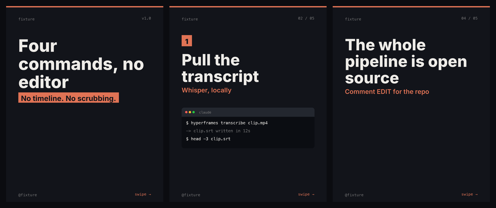
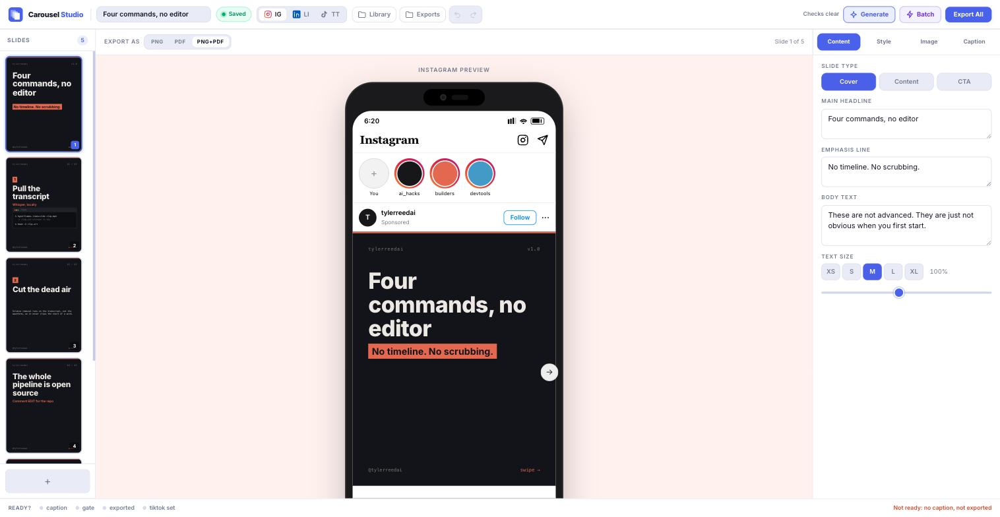

# Social Studio

Build branded carousels, TikTok slideshows and Reels for Instagram, TikTok and
LinkedIn. AI writes the copy, you control the design, and the export matches
what you saw on screen.

Runs locally. Bring your own API keys — nothing goes anywhere except the model
provider you configure. No CDN, no telemetry, no font requests; the editor
works with the network off.


[](https://github.com/tylerprogramming/social-studio/actions/workflows/ci.yml)



These are exported PNGs, not mockups — and they are the same files the test
suite holds the renderer to, so this picture cannot drift from what you get.



## What it does

- **Writes the slides.** Give it a topic and a framework; Claude returns every
  slide, schema-constrained. Captions too, Instagram and LinkedIn.
- **Generates backgrounds.** Per slide or per carousel, via Kie.ai, optionally
  using a photo of you as a likeness reference. Runs as a background job, so
  the editor stays usable while images render.
- **Exports what you see.** PNG, PDF, or an MP4 slide. The Python renderer is a
  deliberate mirror of the live preview, down to the line-box maths.
- **Three layouts.** A standard editorial slide, a `terminal` variant with a
  real terminal window for command-line content, and `tall` — that same
  terminal design drawn native 9:16 for TikTok rather than padded to fit.
- **Reframes for TikTok**, clear of the caption block and action rail. A `tall`
  carousel skips the reframe: it is already 1080x1920.
- **Writes alt text**, one per slide, from the slide's own words — so it works
  with no API key. Saved into `captions.md` to paste when you post.
- Undo/redo, drag to reorder, shift-click any control to apply it to every
  slide, and an exports gallery.

## Quickstart

**You need** [Bun](https://bun.sh) 1.1+ and Python 3.9+. Everything else `setup`
handles or tells you how to get.

```bash
git clone https://github.com/tylerprogramming/social-studio.git
cd social-studio
bun run setup             # checks what you have, installs the rest
bun run dev               # http://localhost:5175
```

`setup` installs the dependencies and Pillow, writes `settings.json` and `.env`,
and tells you exactly what to run if Python or ffmpeg is missing. It never
installs a language runtime for you and never overwrites config you already have.

**It opens with two example carousels**, so there is something on screen before
you have typed anything. They are ordinary decks — edit them, or delete them.

### You do not need an API key

Editing, rendering, exporting, themes, custom fonts and alt text all work with
no key at all. A key is only needed for Claude to *write* slide copy and
captions. `ffmpeg` is only needed for video; PNG and PDF do not touch it.

Production: `bun run build && bun run start`, then http://localhost:3010.

Tests: `bun run test`. Typecheck: `bun run typecheck`. Both run in CI.

### Keys

| Key | Needed for |
|---|---|
| `ANTHROPIC_API_KEY` | Slide copy and captions |
| `KIE_API_KEY` | AI background images |
| `OPENAI_API_KEY` | Optional fallback, used only when `ANTHROPIC_API_KEY` is unset |

Real environment variables win over `.env`. If you use Claude Code, keys in
`~/.claude/.env` are picked up automatically.

### Make it yours

**Settings** in the header covers the ones that change what you see — handle,
typefaces, brand voice, export folder — and reports whether this machine can
render slides and video. Nothing needs a restart.

The rest live in `settings.json`:

```bash
cp settings.example.json settings.json
```

| Field | What it does |
|---|---|
| `handle` | Your handle. Appears on slides and in the preview mockups. |
| `brandVoice` | A sentence on how captions should sound. |
| `exportDir` | Where exports land. Defaults to `./exports`. Supports `~`. |
| `imagesDir` | Where generated images land. Defaults to `./images`. |
| `communityUrl` | Link shown on video footers. Omitted if unset. |
| `likenessPath` | A photo of you, used as a reference image for generation. |
| `likenessDescription` | Appended to image prompts so the model gets you right. |
| `pythonPath` | The interpreter that renders slides. Unset, the first one that can import Pillow wins. |
| `fontPath` | Body typeface. A filename in `fonts/`, or an absolute path. Unset, the vendored Inter. |
| `monoFontPath` | Monospace typeface for the terminal variant. Same rules. |

If you have more than one Python, set `pythonPath`. The app does not trust
`python3` to mean the same thing tomorrow — installing anything that pulls in a
Python can put a new interpreter ahead of the one Pillow lives in. `GET
/api/health` reports which one was chosen, what it renders with, and whether
ffmpeg is present.

Different builds of the same Pillow version link different FreeType versions,
and that changes exported pixels. If you care about slides staying consistent
with ones you have already posted, pin the interpreter.

## Themes

A theme is one JSON file in `themes/`. Drop it in, reload, it appears as a
swatch. Only the three colours are required.

```json
{ "name": "Midnight", "bgColor": "#1A1A2E", "textColor": "#F5F0EB", "accentColor": "#5BA4CF" }
```

Full format and the contrast trap: [`themes/README.md`](themes/README.md).

## Fonts

Drop a `.ttf` in `fonts/` and name it in `settings.json` as `fontPath`. The
browser is served the same file the renderer draws with, so the preview stays a
preview. Variable fonts get their weight axis driven properly; static fonts work
but come out at one weight. See [`fonts/README.md`](fonts/README.md).

## Frameworks

A framework is one JSON file in `frameworks/`, discovered at startup.
`systemPrompt` sets the voice; each slide's `purpose` tells the model what job
that slide does. Neither is sent to the browser.

```json
{
  "id": "hormozi",
  "name": "Hormozi",
  "slideCount": 7,
  "systemPrompt": "…",
  "slides": [{ "slideNumber": 1, "type": "cover", "purpose": "…" }]
}
```

## Renderer parity — read this before editing

`generate_slide.py` and `client/src/components/SlidePreview.tsx` are two
implementations of the same design. Every geometry constant, font size, weight
and colour rule lives in both, and **changing one means changing the other** —
otherwise the app stops being a preview of what you actually post.

The Python side reproduces the CSS layout model rather than approximating it:
line boxes with half-leading, `object-fit: cover` cropping, and Inter selected
on its variable weight axis.

Every number that differs between the 4:5 terminal slide and its 9:16 `tall`
twin lives in one table: `terminal_geometry()` in `generate_slide.py`, copied
field for field as `terminalGeometry()` in `client/src/lib/geometry.ts` and
imported by `check_slides.py`. Adding a canvas means editing that table, not
hunting literals.

`bun test tests/` enforces this rather than trusting it — the two tables are
diffed field for field on every run, so drift fails instead of shipping. See
[`tests/README.md`](tests/README.md).

Similarly, `flash_video.py` (1080x1920, standalone Reels) and `slide_video.py`
(a slide inside a carousel, at that slide's own size) are separate on purpose.
Same idea, different job.

## Layout

```
server.ts              Hono app: settings, themes, carousels, rendering, libraries
lib/                   Paths, settings, the Python resolver, media types, fonts, alt text
examples/              Example carousels, copied in on an empty first run
scripts/setup.ts       bun run setup
routes/                ai.ts (copy + captions), jobs.ts (image queue),
                       renditions.ts (TikTok reframe, video)
generate_slide.py      Slide renderer + PDF combiner  -- twin of SlidePreview.tsx
tests/                 Parity, checker and golden-render tests. See tests/README.md
generate_bg_image.py   Kie.ai image generation
slide_video.py         A carousel slide as MP4, at whatever size the slide is
flash_video.py         A standalone 1080x1920 Reel
tiktok_safe.py         Reframe a slide clear of TikTok's UI
themes/                One JSON per theme
frameworks/            One JSON per framework
fonts/                 Inter and JetBrains Mono, vendored -- the renderer and the
                       browser load the same files, so no CDN and no drift
client/src/            React 19 + Vite, port 5175
```

## API

| Method | Path | |
|---|---|---|
| `GET` | `/api/frameworks` `/api/themes` | List frameworks / themes |
| `POST` | `/api/ai-generate` `/api/bulk-generate` | Generate one / many carousels |
| `POST` | `/api/captions` | Write Instagram + LinkedIn captions |
| `GET` `POST` | `/api/carousels` | List / save |
| `GET` `DELETE` | `/api/carousels/:id` | Load / delete |
| `POST` | `/api/jobs/generate-bg` | Queue background generation |
| `GET` `DELETE` | `/api/jobs` `/api/jobs/:id` | Poll / cancel jobs |
| `GET` `DELETE` | `/api/images` | Browse / delete images |
| `POST` | `/api/generate-slide` `/api/export-all` | Render one slide / all + PDF |
| `POST` | `/api/slide-video` | Render a slide as MP4 |
| `POST` | `/api/flash-video` | Render a standalone Reel |
| `GET` | `/api/exports` | Exported carousels |
| `GET` `POST` | `/api/settings` | Read / update settings |
| `GET` | `/api/health` | Which Python, what it renders with, whether ffmpeg is present |
| `GET` | `/api/fonts` | Typefaces available in `fonts/`, and which are selected |

## Keyboard shortcuts

`⌘Z` / `⇧⌘Z` undo, redo · `⌘S` save · `⌘D` duplicate slide · `⌘E` export

## Export

```
exports/my-carousel/
  slide_1.mp4        # if the cover is a video slide
  slide_2.png
  captions.md
  my-carousel.pdf
```

Point `exportDir` at a content repo to write straight into it.

## Contributing

[`CONTRIBUTING.md`](CONTRIBUTING.md) — setup, the parity contract, and what to
do when the golden tests fail. A new look is usually a theme and a new structure
is usually a framework; both are one JSON file and need no code.

## License

MIT — see [LICENSE](LICENSE).

The vendored fonts keep their own: Inter and JetBrains Mono are both SIL Open
Font License 1.1, see [`fonts/JetBrainsMono-OFL.txt`](fonts/JetBrainsMono-OFL.txt).
